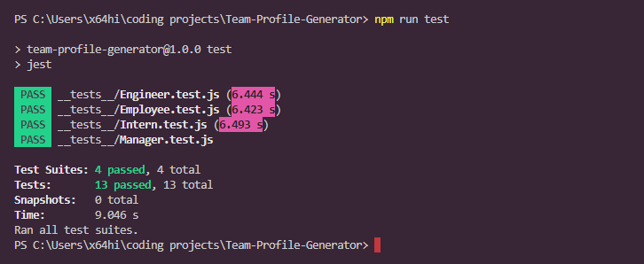
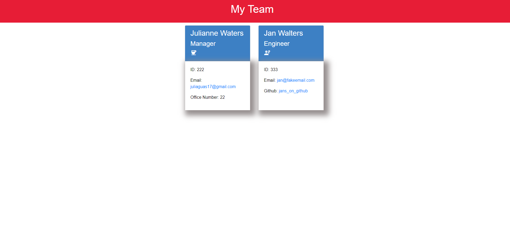

# Team Profile Generator
 
## Description
The purpose of this challenge is to build a Node.js command-line application that takes in information about employees on a software engineering team and generates an HTML webpage that displays summaries for each person. 

## Installation
Clone the repository from Github and run "npm i". This application also requires Inquirer and utilizes Jest for testing purposes. Run "npm test" to run Jest.

## Usage
Below are screenshot examples of running Jest for testing purposes and an example HTML created in the CLI. I've also included a demo video showing how to create the HTML.

<!--Tests-->

<!--HTML example-->

<!--Video walkthrough-->
[Demo Video](assets/team_directory_walkthrough.mp4)